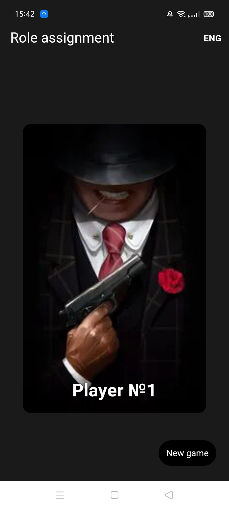
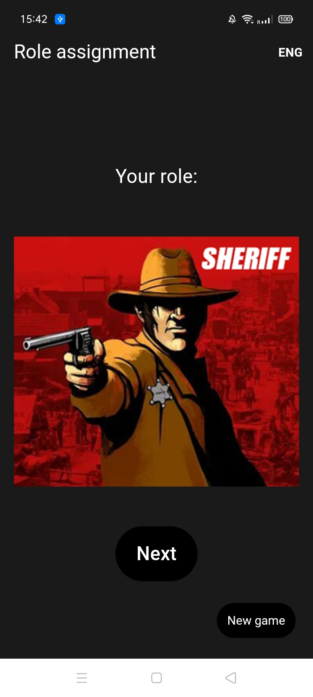
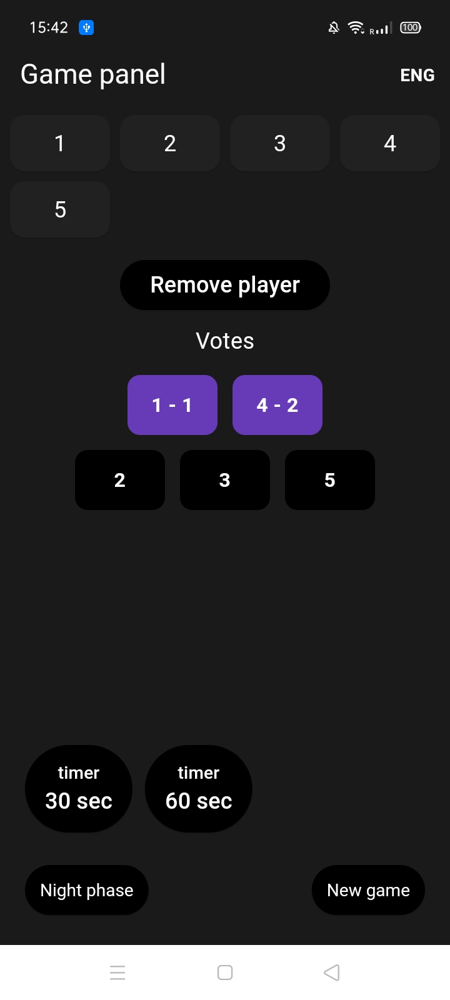
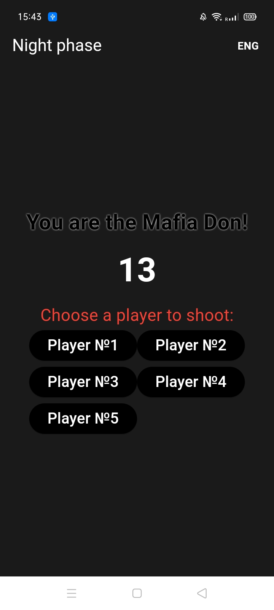

Mafia Host Assistant (Offline)

A lightweight offline helper app for Sports Mafia (classic tournament-style Mafia).
Made for the host/moderator who wants to run the game smoothly without knowing players’ roles.

## ⬇️ Download APK

**Latest release:**  
[Download APK](https://github.com/Cjlecap8899/mafia_host_app/releases/download/v1.0.1/mafia_host_app_v1.0.1.apk)

**SHA-256 checksum:**  
`3641757747aeb97d1f4d929be517bd3e706d6a89668773c5a7305d03abe276e6`

---

📸 Screenshots

✅ Features
🎮 Game Modes

You can start a game with different player counts:

10 players (standard mode)
Classic setup with full role distribution.

9 players (special mode)
Roles: Sheriff, 6 Citizens, 2 Mafia, Don
⚠️ The app still creates 10 players, but Player #10 is always a Citizen.
(Many hosts remove this player early depending on house rules.)

8 players
Roles: 1 Mafia, Don, Sheriff, 5 Citizens

🃏 Role Assignment (Host stays blind)

Roles are distributed using a card-pick system

Each player reveals their role only on their turn

The host can continue the game without learning any roles

☀️ Day Phase (Game Panel)

Track alive players

Add/remove fouls:

Tap → add foul

Double tap → remove foul

Remove a player manually (with confirmation)

Voting notes panel:

Tap to activate

Tap again to set vote count

🌙 Night Phase

Players act one by one:

Citizens solve a math task

Sheriff checks a player

Don shoots + checks who is Sheriff

Mafia shoots

At the end of the night the app calculates the night result and returns to day phase.

🌍 Multi-language Support

Russian 🇷🇺

English 🇬🇧

Ukrainian 🇺🇦

Spanish 🇪🇸

The selected language is saved and will remain after restarting the app.

🧠 How to Use
1) Choose Player Count

Start from the first screen and select:

10 players

9 players (special rule: Player #10 is always Citizen)

8 players

Test mode (if enabled)

2) Assign Roles

For each player:

Tap the player card (confirmation required)

If multiple cards are available — choose a card

The role will be revealed

Tap Next to move to the next player

After the last player, the app automatically goes to the Game Panel.

3) Day Phase (Game Panel)

Tap player → add foul

Double tap player → remove foul

Remove player button → eliminate manually

Night Phase button → go to night actions

4) Voting Panel

Tap a number → activate it

Tap again → choose how many votes this player received

Double tap → remove this player from voting notes

5) Night Phase

Each alive player acts depending on their role.
After all actions are done, tap Day Phase to continue.

⏱️ Timer Controls (Important)

The app includes 30s and 60s timers for speeches:

Controls

Single tap

Start timer

Pause timer (if already running)

Resume timer

Double tap

Stop timer completely

Reset back to the initial value

Effects

Voice notifications (TTS)

Vibration warning near the end

Long vibration when time is over

🛠️ Build & Run
Requirements

Flutter SDK

Android device or emulator

Run in debug mode
flutter pub get
flutter run

Build APK (release)
flutter build apk --release

The APK will be located here:

build/app/outputs/flutter-apk/app-release.apk

🧾 Roadmap / Ideas

Planned improvements (optional):

 Better UI scaling for different screen sizes

 Game presets for different Mafia rule sets

 Sound pack / different timer voices

 Export game history / logs

 Tablet-friendly layout

⚠️ Notes

This app is designed to be fast, offline, and safe from accidental misclicks
(using confirmations for important actions).

## 📄 License
MIT License
